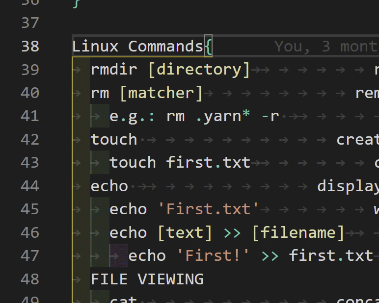

# TechNotes
A Collection of my text file notes on a broad range of technical topics.

## Installation
In a folder of your choosing, open up a shell and clone the repository
git clone https://github.com/StephenJBrasel/TechNotes.git

## Usage

### Notes
Generally the notes follow the following pattern:
```txt
Topic {
  Interesting Thing             Description of interesting thing
}
```
In [VS Code](https://code.visualstudio.com/download) you can collapse ("Fold") Topics by hovering the mouse over the left side of a line that ends in `{` and toggling the arrow that appears. 

***

***

### Config
Read the file first to make sure that nothing is that you don't want. I know it's safe, but you should always make sure.  
If it all looks good, double-click to run it like you would a program shortcut, .exe, or .app.
